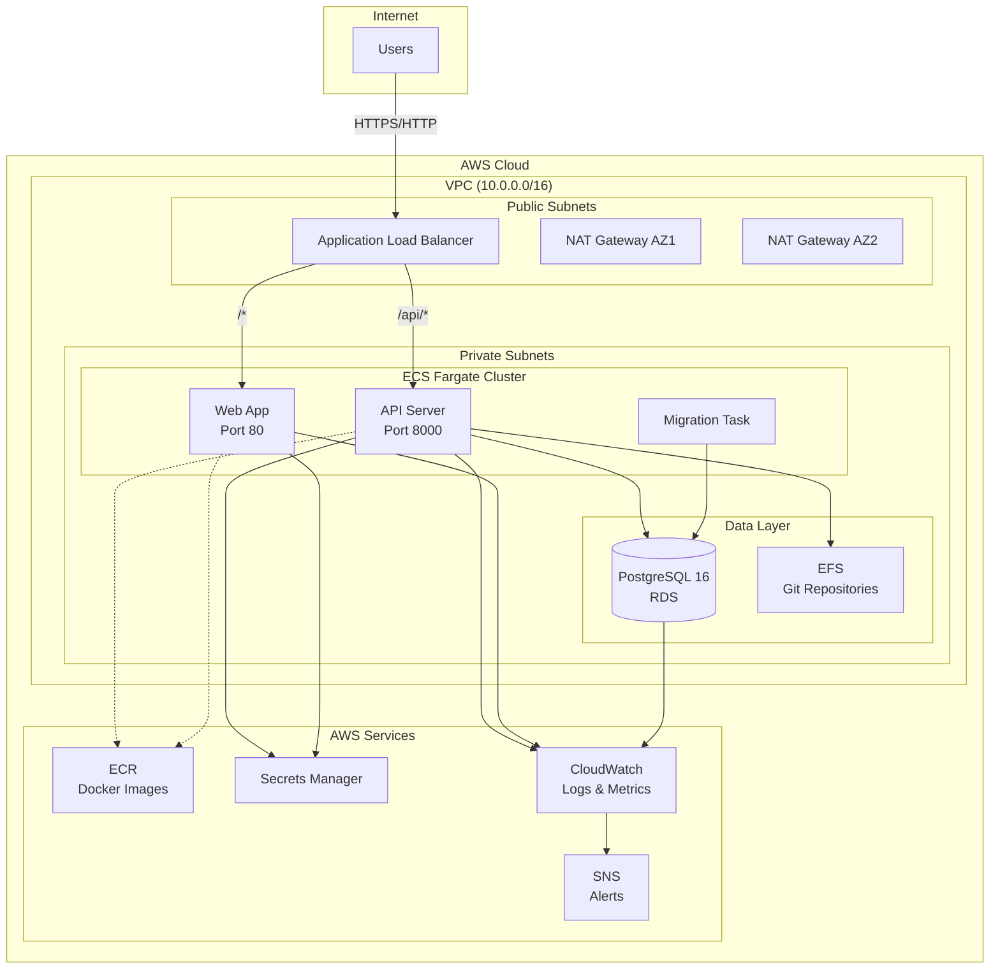

# Plue Infrastructure

This directory contains the Terraform infrastructure code for deploying the Plue application to AWS.

## Architecture Overview



## Prerequisites

- AWS CLI configured with appropriate credentials
- Terraform >= 1.5.0
- Docker for building and pushing images
- An S3 bucket for Terraform state storage (optional but recommended)

## Directory Structure

```
infra/
├── docker/                 # Docker configuration files
│   ├── Dockerfile
│   ├── Dockerfile.healthcheck
│   └── docker-compose.yml
├── environments/          # Environment-specific configurations
│   ├── dev/              # Development environment
│   └── production/       # Production environment
├── modules/              # Reusable Terraform modules
│   ├── network/          # VPC, subnets, NAT gateways
│   ├── database/         # RDS PostgreSQL
│   ├── storage/          # EFS for git repositories
│   ├── ecr/              # ECR repositories
│   ├── ecs-cluster/      # ECS Fargate cluster
│   ├── api-server/       # API server ECS service
│   ├── web-app/          # Web app ECS service
│   └── load-balancer/    # Application Load Balancer
└── README.md             # This file
```

## Deployment Instructions

### 1. Initial Setup

#### Configure Terraform Backend (Recommended)

Create an S3 bucket and DynamoDB table for Terraform state:

```bash
# Create S3 bucket for state
aws s3 mb s3://your-terraform-state-bucket --region us-east-1

# Create DynamoDB table for state locking
aws dynamodb create-table \
    --table-name terraform-state-lock \
    --attribute-definitions AttributeName=LockID,AttributeType=S \
    --key-schema AttributeName=LockID,KeyType=HASH \
    --billing-mode PAY_PER_REQUEST \
    --region us-east-1
```

Update the backend configuration in `environments/{env}/versions.tf`:

```hcl
backend "s3" {
  bucket         = "your-terraform-state-bucket"
  key            = "plue/{env}/terraform.tfstate"
  region         = "us-east-1"
  dynamodb_table = "terraform-state-lock"
  encrypt        = true
}
```

### 2. Build and Push Docker Images

```bash
# Authenticate Docker to ECR
aws ecr get-login-password --region us-east-1 | docker login --username AWS --password-stdin <account-id>.dkr.ecr.us-east-1.amazonaws.com

# Build images
cd infra/docker
docker build -t plue-api --target cli .
docker build -t plue-web --target web .

# Deploy infrastructure first to create ECR repositories
cd ../environments/dev
terraform init
terraform apply -target=module.ecr

# Get ECR repository URLs from Terraform output
API_REPO=$(terraform output -raw ecr_api_repository_url)
WEB_REPO=$(terraform output -raw ecr_web_repository_url)

# Tag and push images
docker tag plue-api:latest $API_REPO:latest
docker tag plue-web:latest $WEB_REPO:latest
docker push $API_REPO:latest
docker push $WEB_REPO:latest
```

### 3. Deploy Infrastructure

#### Development Environment

```bash
cd infra/environments/dev
terraform init
terraform plan
terraform apply
```

#### Production Environment

```bash
cd infra/environments/production

# Create terraform.tfvars with required variables
cat > terraform.tfvars <<EOF
certificate_arn = "arn:aws:acm:us-east-1:123456789012:certificate/xxxxxxxx"
sns_alert_email = "alerts@example.com"
EOF

terraform init
terraform plan
terraform apply
```

### 4. Run Database Migrations

After the infrastructure is deployed, run the database migration task:

```bash
# Get outputs
CLUSTER_NAME=$(terraform output -raw ecs_cluster_name)
TASK_DEF_ARN=$(terraform output -raw migrate_task_definition_arn)
SUBNET_ID=$(terraform output -json | jq -r '.vpc_id.value' | xargs -I {} aws ec2 describe-subnets --filters "Name=vpc-id,Values={}" "Name=tag:Type,Values=private" --query 'Subnets[0].SubnetId' --output text)

# Run migration task
aws ecs run-task \
    --cluster $CLUSTER_NAME \
    --task-definition $TASK_DEF_ARN \
    --launch-type FARGATE \
    --network-configuration "awsvpcConfiguration={subnets=[$SUBNET_ID],assignPublicIp=DISABLED}"
```

### 5. Access the Application

After deployment, you can access the application using the ALB DNS name:

```bash
# Get the application URL
terraform output alb_url
```

## Environment Variables

### Required Secrets in AWS Secrets Manager

The following secrets are automatically created and managed by Terraform:

- `{environment}-plue-db-password`: Database master password
- `{environment}-plue-db-connection`: Full database connection details including URL

### Application Environment Variables

- `DATABASE_URL`: Automatically injected from Secrets Manager
- `PORT`: Set to 8000 for API server
- `API_ENDPOINT`: Set for web app to connect to API

## Monitoring and Logging

### CloudWatch Logs

All application logs are sent to CloudWatch Log Groups:

- `/ecs/{environment}/plue-api-server`
- `/ecs/{environment}/plue-web-app`
- `/ecs/{environment}/plue-db-migrate`
- `/aws/rds/instance/{environment}-plue-db/postgresql`

### CloudWatch Alarms (Production)

The following alarms are configured for production:

- Database CPU utilization > 80%
- Database free storage < 5GB
- API server CPU utilization > 90%
- Web app CPU utilization > 90%
- Unhealthy ALB targets

Alarms send notifications to the configured SNS topic email.

### Container Insights

ECS Container Insights is enabled for the production cluster, providing detailed metrics about container performance.

## Cost Optimization

### Development Environment

- Single NAT Gateway (saves ~$45/month)
- Fargate Spot instances where possible
- Minimal instance sizes (t3.micro for RDS)
- Container Insights disabled
- Shorter log retention periods

### Production Environment

- Multi-AZ deployment for high availability
- Standard Fargate instances for reliability
- Appropriately sized instances based on load
- Full monitoring and alerting enabled

## Cost Estimates

### Development Environment

- VPC & Networking: ~$45/month (NAT Gateway)
- RDS (db.t3.micro): ~$15/month
- ECS Fargate: ~$20-40/month (depends on usage)
- EFS: ~$0.30/GB/month
- ALB: ~$20/month
- **Total**: ~$100-120/month

### Production Environment

- VPC & Networking: ~$90/month (2 NAT Gateways)
- RDS (db.t3.small, Multi-AZ): ~$50/month
- ECS Fargate: ~$100-200/month (depends on scale)
- EFS: ~$0.30/GB/month
- ALB: ~$20/month
- **Total**: ~$260-380/month

## Security Considerations

1. **Network Security**
   - All services run in private subnets
   - Security groups follow least-privilege principle
   - VPC Flow Logs enabled for audit

2. **Data Security**
   - RDS encryption at rest enabled
   - EFS encryption at rest enabled
   - Secrets stored in AWS Secrets Manager
   - SSL/TLS termination at ALB (production)

3. **Access Control**
   - IAM roles with minimal required permissions
   - No hardcoded credentials
   - Task roles separate from execution roles

## Troubleshooting

### Common Issues

1. **ECS Tasks Not Starting**
   - Check CloudWatch logs for the service
   - Verify ECR images are pushed correctly
   - Check security group rules
   - Ensure IAM roles have correct permissions

2. **Database Connection Errors**
   - Verify security group allows traffic from ECS tasks
   - Check Secrets Manager permissions
   - Ensure RDS is in available state

3. **ALB Health Check Failures**
   - Verify health check path returns 200 OK
   - Check security groups allow ALB to reach targets
   - Review application logs for startup errors

### Useful Commands

```bash
# View ECS service events
aws ecs describe-services --cluster $CLUSTER_NAME --services plue-api-server

# View task logs
aws logs tail /ecs/dev/plue-api-server --follow

# Force new deployment
aws ecs update-service --cluster $CLUSTER_NAME --service plue-api-server --force-new-deployment

# Check RDS status
aws rds describe-db-instances --db-instance-identifier dev-plue-db
```

## Cleanup

To destroy the infrastructure:

```bash
# First, disable deletion protection (if enabled in production)
terraform apply -var="database_deletion_protection=false" -var="alb_deletion_protection=false"

# Then destroy
terraform destroy
```

**Warning**: This will delete all data including the database and EFS files.

## Future Enhancements

- [ ] Add AWS WAF for additional security
- [ ] Implement auto-scaling based on custom metrics
- [ ] Add Redis/ElastiCache for caching
- [ ] Set up CI/CD pipeline for automated deployments
- [ ] Implement blue-green deployments
- [ ] Add AWS Backup for automated backups
- [ ] Implement cross-region disaster recovery